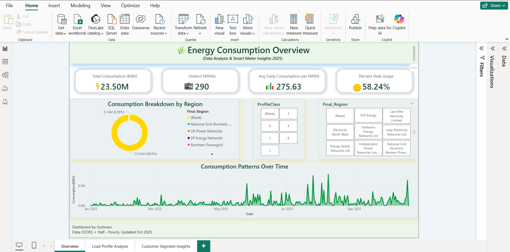
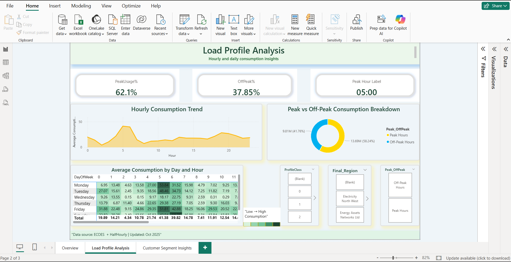
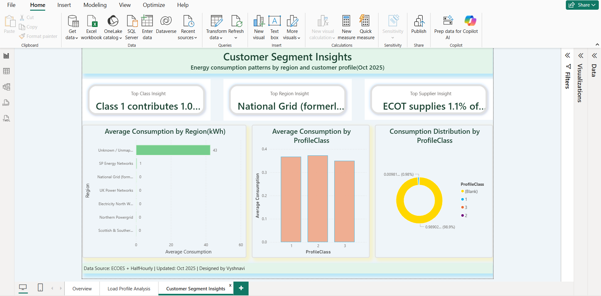
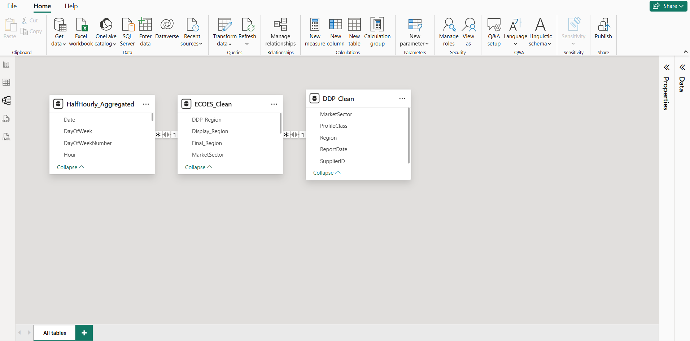

<<<<<<< HEAD
# ⚡ Energy Consumption Load Profile Analysis

An end-to-end data analytics project analysing half-hourly smart meter electricity consumption data, enriched with industry reference datasets, to uncover **when, where, and who** consumes the most energy.

This project demonstrates strong **data modelling**, **DAX proficiency**, and **business-focused storytelling** using Power BI.

---

## 🎯 Project Objective

The objective of this project was to:

- Analyse large-scale half-hourly electricity consumption data  
- Enrich raw meter readings with customer and regional metadata  
- Identify peak vs off-peak usage patterns  
- Understand regional and customer-segment consumption behaviour  
- Translate complex data into clear operational insights  

This simulates how energy analytics teams use smart-meter data to support:

- Billing accuracy  
- Load forecasting  
- Operational planning  
- Sustainability initiatives  

---

## 🧰 Tools & Technologies

- **Power BI Desktop**
- **Power Query (ETL)**
- **Star Schema Data Modelling**
- **DAX (23+ measures)**
- **Time-based Analysis**
- **Git & GitHub** (documentation & version control)

---

## 📁 Repository Structure

```text
energy-consumption-load-profile-analysis/
├── documentation/
│   └── calculations.md        # All DAX measures with explanations
├── images/                    # Dashboard screenshots (added later)
├── powerbi_dashboard/         # PBIX or export assets (optional)
├── sample_data/               # Schema or mock structure only (no raw data)
└── README.md
```

⚠️ **Raw industry data is intentionally excluded** for confidentiality and ethical reasons.

---

## 🧩 Data Overview

The analysis is based on three logical datasets:

| Dataset | Description |
|------|------------|
| Half-Hourly Smart Meter Data | Time-stamped electricity consumption readings |
| Customer Metadata | Meter-to-customer and regional mapping |
| Industry Reference Data | Profile class and regional standardisation |

The half-hourly consumption table acts as the **fact table**, while the others are treated as **dimension tables**.

---

## 🧹 Data Cleaning & Transformation (Power Query)

### Half-Hourly Consumption Data
- Removed non-essential columns  
- Filtered to:
  - Electricity meters only  
  - Import readings only  
- Removed null timestamps and consumption values  
- Created derived fields:
  - Date  
  - Hour  
  - Day of Week  
  - Month  
- Aggregated data:
  - Grouped by MPAN, Date, Hour  
  - Reduced ~2.4M rows → ~1.2M rows for performance  

### Metadata & Reference Data
- Trimmed and standardised text fields  
- Removed duplicates and blanks  
- Harmonised region naming  
- Created fallback logic for unmapped regions  

---

## 🔗 Data Model

A **star schema** was designed for clarity and performance.

### Fact Table
- `HalfHourly_Aggregated`

### Dimension Tables
- Customer Metadata  
- Industry Reference Mapping  

### Relationships
- Customer Metadata → Half-Hourly Data (MPAN, one-to-many)  
- Industry Mapping → Customer Metadata (Profile Class, one-to-many)  

This ensures clean filter propagation and efficient DAX calculations.

---

## 🧮 DAX Measures & Calculations

A total of **23 DAX measures** were created, grouped into:

### Core Consumption Metrics
- Total Consumption (kWh)  
- % of Total Consumption  
- Distinct MPANs  
- Average Daily Consumption per MPAN  

### Time-Based Analysis
- Peak Consumption (07:00–22:00)  
- Off-Peak Consumption  
- Peak Usage %  
- Off-Peak %  
- Peak Hour & Peak Hour Label  
- Time-of-Day Categories  

### Customer & Regional Insights
- Top Profile Class Insight  
- Top Region Insight  
- Top Supplier Insight  
- Supporting percentage measures  

📄 All formulas are fully documented in  
**`documentation/calculations.md`**

---

## 📊 Dashboard Overview (Power BI)

### 📷 Dashboard Screenshots

#### Overview


#### Load Profile


#### Customer Insights


#### Data Model (Star Schema)



The report is structured into three analytical pages, each answering a specific business question.

### Page 1 — Overview: Energy Consumption Summary
**Purpose:** High-level operational snapshot  

- KPI cards:
  - Total Consumption  
  - Distinct MPANs  
  - Average Daily Consumption  
  - Peak Usage %  
- Donut chart: Consumption by Region  
- Line chart: Consumption trends over time  
- Interactive slicers for region and profile class  

---

### Page 2 — Load Profile Analysis
**Purpose:** Understand *when* electricity is used  

- Peak %, Off-Peak %, Peak Hour KPIs  
- Hourly consumption trend (24-hour profile)  
- Peak vs Off-Peak donut chart  
- Heatmap (Day of Week × Hour)  
- Time-based slicers  

---

### Page 3 — Customer Segment Insights
**Purpose:** Identify *who* consumes the most energy  

- Dynamic text insights (Top Class, Region, Supplier)  
- Average consumption by region  
- Average consumption by profile class  
- Distribution of consumption across customer types  

---

## 🧪 Data Validation & Quality Checks

To ensure analytical accuracy:

- Verified total consumption before and after aggregation  
- Confirmed peak + off-peak = 100%  
- Checked relationship cardinality  
- Validated MPAN counts after joins  
- Ensured no circular dependencies  

---

## 📈 Analytical Flow

```text
Raw Half-Hourly Data
        ↓
Power Query Cleaning & Aggregation
        ↓
Metadata Enrichment & Modelling
        ↓
DAX Measures & KPIs
        ↓
Interactive Dashboards
        ↓
Operational Insights
```

---

## 💼 Skills Demonstrated

- Large-scale data handling & optimisation  
- Star schema data modelling  
- Advanced DAX (VAR, TOPN, SUMMARIZE)  
- Time-series and load profile analysis  
- Business-oriented dashboard storytelling  
- Data validation and QA thinking  

---

## 🚀 Outcome

This project demonstrates the ability to transform raw smart-meter data into a **clear analytical narrative**, answering:

- How much energy is used?  
- When is it used most?  
- Which customer segments drive consumption?  

It reflects real-world analytics work in **energy, utilities, and operations teams**, balancing technical depth with business clarity.
